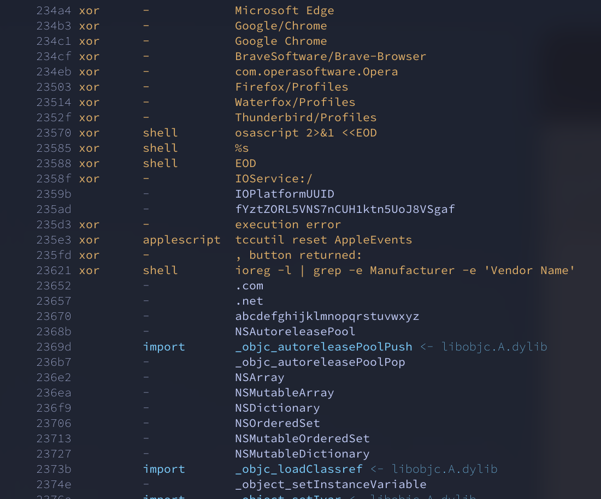

**stng** — Language-aware string extraction for binary malware analysis. Extract indicators, hardcoded credentials, C2 addresses, and obfuscated strings from any binary.

## Screenshot

Demonstrating the automatic XOR-decoding capabilities on an AMOS malware sample (macOS):


## Quick Start

```bash
stng malware.bin              # Full analysis with XOR auto-detection
stng -i malware.bin           # Filter noise (known library strings)
stng --json malware.bin       # Machine-readable output
```

## Detection Capabilities

- **Binary network structures**: Hardcoded IPs/ports in socket structures, network byte order
- **XOR obfuscation**: Single/multi-byte keys with entropy analysis, double-layer (encoding+XOR)
- **Encoding detection**: Base64, Base32, Base85, hex, URL-encoding, Unicode escapes
- **Language-aware extraction**: Go/Rust `{ptr, len}`, DWARF stack strings
- **IOC classification**: IPs, URLs, shell commands, paths, credentials
- **Wide strings**: UTF-16LE in Windows PE binaries
- **Format support**: ELF, PE, Mach-O, raw binaries, overlays

## Use Cases

- **C2 enumeration**: Extract hardcoded callbacks, encryption keys, beacon URLs
- **Credential/evasion analysis**: Database passwords, API keys, XOR'd strings, packed payloads
- **YARA acceleration**: Find strings for signature development

## Library

```rust
let strings = stng::extract_strings(&std::fs::read("sample")?, 4);
```
License: Apache-2.0
